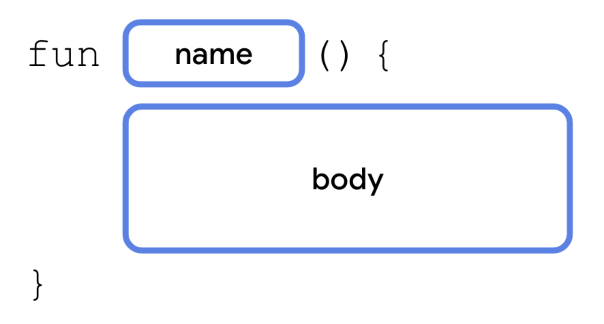

<h1 align="center">Grundlagen der Programmierung</h1>
<h3 align="center">Funktionen</h3>
<br>

<p align="center">
  
</p>

### Beschreibung
In Kotlin sind Funktionen super praktisch, weil sie dir helfen, Code in kleine Teile aufzuteilen, die du wieder und wieder verwenden kannst. Das macht deinen Code leichter zu verstehen und zu bearbeiten. Das kannst du heute direkt einmal ausprobieren!

> #### Hinweise zur Bearbeitung
> - Achte darauf, dass dein Quellcode sauber ist. Besonders die Einrückungen sind wichtig!
> - Verwende Dokumentationskommentare, um deinen Code zu erklären und zu dokumentieren.
> - Teste deinen Code. Er sollte nicht nur kompilieren und ausführbar sein, sondern auch das gewünschte Ergebnis liefern.
> - `Commit & Push` dein Ergebnis am Ende des Tages
<br>

<details>
<summary> <b> Aufgabe 0 - Single Choice Quiz </b></summary>
**Datei für die Aufgabe** *Aufgabe00*

Beantworte die Quizfragen zum Thema Funktionen. Es ist jeweils 1 Antwort richtig.
</details>

<details>
<summary> <b> Aufgabe 1 - Funktion implementieren und aufrufen </b> </summary>

**Datei für die Aufgabe:** *1_FunktionImplementierenUndAufrufen*

In dieser Aufgabe wirst du deine erste Funktion implementieren. Die beschriebene Funktion wird in der Konsole eine Summe ausgeben.

Vorgaben:
- fange oberhalb der main-Funktion an
- schreibe das Keyword für Funktionen `fun`
- nenne deine Funktion `sum()`
- lege im body der Funktion (zwischen den geschweiften Klammern) zwei Variablen an:
  - `number1` hat den Wert `3`
  - `number2` hat den Wert `7`
- gebe mit der println-Anweisung die Summe in der Konsole aus `println(number1 + number2)`
- rufe `sum()` in der Main-Funktion auf

</details>

---

<details>
<summary> <b> Aufgabe 2 - Name für Funktion entwerfen  </b> </summary>

**Datei für die Aufgabe:** *2_Textabgabe.kt*

It’s magic time. Worte und Namen sind mächtig. Was denkst du wieso alle Zauberer und Magier ihre Magie mit Sprüchen beschwören? Diese Macht gilt für alles, was einen Namen hat. 
Deswegen sei weise in der Namensgebung. Ansonsten wird dir dessen Magie noch zum Verhängnis. Bist du ein Champion der magischen IT-Künste? Das wirst du in den folgenden Aufgaben herausfinden.
Weiter unten findest du einen Codeschnipsel einer Funktion. Mit dieser Funktion kann ein Zauberer einen Schutzzauber bewirken. Überlege dir einen passenden Namen und rufe die Funktion in der `main()` auf. Wie geht das nochmal?

```
fun _________(){
   var magicWord1 = "Expecto"
   var magicWord2 = " Patronum"
   print(magicNo1 + magicNo2 + "!!!")
}
```

</details>

---

<details>
<summary> <b> Aufgabe 3 - Name für Funktion entwerfen  </b> </summary>

**Datei für die Aufgabe:** *3_Textabgabe.kt*

Dein Chef hat eine Formel entdeckt, mit der er das Volumen eines Würfels berechnen kann. Aber er tut sich schwer mit der Namensgebung. Kannst du ihm dabei helfen einen geeigneten Namen zu formulieren?

Überlege dir einen passenden Namen und rufe die Funktion in der `main()` auf.

```
fun _______(){
   var side = 4
   var volume = side * side * side
   print("Das Volumen des Wuerfels betraegt: " + volume + " cm^3")
}

```

</details>

---

<details>
<summary> <b> Aufgabe 4 - Vorhersagen, wo Programmfluss bei Funktionsaufruf als Nächstes hinspringen würde </b> </summary>

**Datei für die Aufgabe:** *4_Textabgabe.kt*

Hier gibt es jetzt 2 Funktionen, die in der Main-Funktion aufgerufen werden. Schreibe in die Aufgabe was in der Konsole ausgegeben wird.

```
fun animal() {
    val myAnimal: String = "Dog"
    println(myAnimal)
}
fun number() {
    val myNumber: Int = 8
    println(myNumber)
}
fun main(){
   number()
   animal()
}
```

</details>

---

<details>
<summary> <b> Aufgabe 5 - Subtrahieren  </b> </summary>

**Datei für die Aufgabe:** *5_FunktionSubtrahieren.kt*

Schreibe eine Funktion, in der eine Zahl von einer anderen Zahl abziehst und das Ergebnis in der Konsole ausdruckst.

Rufe die Funktion in der main-Funktion auf!

</details>

---

<details>
<summary> <b> Aufgabe 6 - Hier stimmt doch was nicht?  </b> </summary>

**Datei für die Aufgabe:** *6_Textabgabe.kt*

Diese Funktion sollte eigentlich zwei Zahlen addieren, allerdings hat der Programmierer hier einen Fehler gemacht. Schreibe in deinen eigenen Worten auf wo der Fehler liegt. 

```
addition() {
    val number1 = 10
    val number2 = 4
    println(number1 + number2)
}
```
**Hinweis:** manchmal reicht ein falsches/fehlendes Wort, dass dein Code nicht mehr funktioniert.

</details>

---

<details>
<summary> <b> Aufgabe 7 - Vorhersagen, was Funktion ausgeben würde  </b> </summary>

**Datei für die Aufgabe:** *7_Textabgabe.kt*

Hier siehst du die Funktion equipmentReminder eines Smartphones.

a)
Was genau wird in der gegebenen Funktion ausgegeben?
```
fun equipmentReminder(){
    var weekday: String = "Montag"

    if (weekday == "Montag"){
        println("Heute hast du Training, nimm deine Sporttasche mit.")
    } else if (weekday == "Mittwoch"){
        println("Heute hast du Musikunterricht, nimm dein Instrument mit.")
    } else if (weekday == "Freitag"){
        println("Heute Abend ist Kinoabend, nimm genug Geld mit.")
    } else {
        println("Heute hast du keinen Termin, du brauchst nichts mit zur Arbeit zu nehmen.")
    }
}
```
b)
Was würde die Funktion ausgeben, wenn die Variable weekday folgendermaßen aktualisiert wird?
```
weekday = "Dienstag"
```


</details>

---

<details>
<summary> <b> Aufgabe 8 - Funktion entwerfen  </b> </summary>

**Datei für die Aufgabe:** *8_FunktionEntwerfen.kt*


a)  
Den Flächeninhalt eines rechtwinkligen Dreiecks lässt sich durch `a * b / 2` ausrechnen.
Implementiere die Berechnung für ein rechtwinkliges Dreieck in einer Funktion. Am Ende dieser Funktion soll das Ergebnis mit println() ausgegeben werden. 

Überlege dir auch einen passenden (englischen) Namen. 

Seite A soll 4cm lang sein und Seite B soll 3 cm lang sein.  

b)  
Ändere jetzt die Funktion, die du in a) geschrieben hast. 
Die Seitenlängen des Dreiecks sollen dann nicht mehr statisch 4cm bzw 3cm sein, sondern sollen vom Nutzer mithilfe einer Eingabe bestimmt werden. Teste deine Funktion und gib **3** als Seitenlänge A und **5** als Seitenlänge B ein. Kommt das Ergebnis **7.5** heraus?

#### Bonus: 
Baue hier Exception Handling mit `try-catch` ein, sodass bei falschen Usereingaben Fehler abgefangen werden. Wenn etwas sinnloses eingegeben wurde, soll für `a` als default Wert `13.0`, für `b` als Default `3.0` genutzt werden.


Rufe die Funktion danach in der `main()` auf!


</details>

---

<details>
<summary> <b> Aufgabe 9 - Funktion entwerfen </b></summary>

**Datei für die Aufgabe:** *9_FunktionEntwerfen.kt*

Schreibe eine Funktion `schaltJahr`, die ein vom Benutzer eingegebenes Jahr darauf prüft, ob es ein Schaltjahr ist. 

Ein Jahr ist ein Schaltjahr, wenn es durch 4 teilbar ist, aber nicht durch 100, es sei denn, es ist auch durch 400 teilbar.

Drucke entsprechendes Feedback in der Konsole aus.

</details>

---

<details>
<summary> <b> Aufgabe 10 - Funktion entwerfen </b></summary>

**Datei für die Aufgabe:** *Aufgabe10.kt*
Erstelle eine Funktion calculator

- Fordere den Anwender über die Konsole auf, die erste Zahl einzugeben.
  - Speicher die eingegebene Zahl in der Variable number1 als Integer ab.
- Fordere den Anwender über die Konsole auf, die zweite Zahl einzugeben.
  - Speicher die eingegebene Zahl in der Variable number2 als Integer ab.

- Nun soll der Anwender entscheiden welcher Operator (+,-,+,/) genutzt werden soll.
  - Dieser Operator soll in der Variable operator als String abgespeichert werden.

- Das Ergebnis der Rechnung soll in der Variable result abgespeichert werden, nutze eine when Verzweigung:
  - ist der operator "+" --> number1 + number2
  - ist der operator "-" --> number1 - number2
  - ist der operator "*" --> number1 * number2
  - ist der operator "/" --> number1 / number2
   

- Achtung! Zahlen können nicht durch 0 geteilt werden 
  - Hinweis: hier brauchen wir noch eine Verzweigung
  - in allen anderen Fällen: "ungültig"

- printe abschließend die Rechenoperation und das Ergebnis. Es könnte folgendermaßen aussehen:
```
Das Ergebnis aus 1 + 2 ist 3.
```
</details>

---

<details>
<summary> <b> Bonus - Zahlenraten </b></summary>

**Datei für die Aufgabe:** *Bonus.kt*

Erstelle in einer Funktion numberGuessing ein kleines Spiel.
Die spielende Person versucht hier eine Zahl zu erraten.

- In der Variable number wird eine zufällige Zahl zwischen 1 und 10 abgespeichert.
  - Das kennt ihr noch nicht, nutzt das Netz oder Lektüre zur Recherche.
  - Hinweis: ihr braucht eine IntRange wie zB 1..10 und könnt darauf `.random()` aufrufen.

- Anschließend wird die spielende Person gebeten eine Zahl zwischen 1 und 10 in die Konsole einzugeben.
  - Diese Zahl wird in der Variable chosenNumber abgespeichert.

- Anschließend überprüft ihr, ob die chosenNumber größer, kleiner oder gleich der number ist
- Printed eine entsprechende Information dazu für die spielende Person aus.

</details>

---
