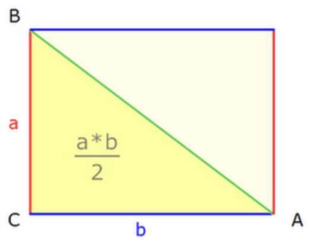
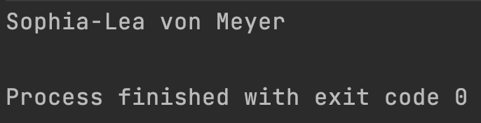

<h1 align="center">Grundlagen der Programmierung</h1>
<h3 align="center">Funktionen</h3>
<br>

<p align="center">
  
</p>

#### Beschreibung:

In Kotlin sind Funktionen super praktisch, weil sie dir helfen, Code in kleine Teile aufzuteilen, die du wieder und wieder verwenden kannst. Das macht deinen Code leichter zu verstehen und zu bearbeiten. Das kannst du heute direkt einmal ausprobieren!

#### Hinweise zur Bearbeitung:

- Achte auf einen sauberen Quellcode, insbesondere Einrückungen sind wichtig!

---

<details>
<summary> <b> Aufgabe 1 - Funktion implementieren und aufrufen </b> </summary>

In dieser Aufgabe wirst du deine erste Funktion implementieren. Die beschriebene Funktion wird in der Konsole eine Summe ausgeben.

Vorgaben:
- fange oberhalb der main-Funktion an
- schreibe das Keyword für Funktionen `fun`
- nenne deine Funktion `sum()`
- lege im body der Funktion (zwischen den geschweiften Klammern) zwei Variablen an:
  - `number1` hat den Wert `3`
  - `number2` hat den Wert `7`
- gebe mit der println-Anweisung die Summe in der Konsole aus `println(number1 + number2)`
- rufe `sum()` in der Main-Funktion auf


**Datei für die Aufgabe:** *1_FunktionImplementierenUndAufrufen*

</details>

---

<details>
<summary> <b> Aufgabe 2 - Name für Funktion entwerfen  </b> </summary>

It’s magic time. Worte und Namen sind mächtig. Was denkst du wieso alle Zauberer und Magier ihre Magie mit Sprüchen beschwören? Diese Macht gilt für alles, was einen Namen hat. 
Deswegen sei weise in der Namensgebung. Ansonsten wird dir dessen Magie noch zum Verhängnis. Bist du ein Champion der magischen IT-Künste? Das wirst du in den folgenden Aufgaben herausfinden.
Weiter unten findest du einen Codeschnipsel einer Funktion. Mit dieser Funktion kann ein Zauberer einen Schutzzauber bewirken. Überlege dir einen passenden Namen.

```
fun _________(){
   var magicNo1 = "Expecto"
   var magicNo2 = "Patronom"
   print(magicNo1 + magicNo2 + "!!!")
}
```

**Datei für die Aufgabe:** *2_Textabgabe.kt*

</details>

---

<details>
<summary> <b> Aufgabe 3 - Name für Funktion entwerfen  </b> </summary>

Dein Chef hat eine Formel entdeckt, mit der er das Volumen eines Würfels berechnen kann. Aber er tut sich schwer mit der Namensgebung. Kannst du ihm dabei helfen einen geeigneten Namen zu formulieren?

```
fun _______(){
   var side = 4
   var volume = side * side * side
   print("Das Volumen des Wuerfels betraegt: " + volume + " cm^3")
}

```

**Datei für die Aufgabe:** *3_Textabgabe.kt*

</details>

---

<details>
<summary> <b> Aufgabe 4 - Vorhersagen, wo Programmfluss bei Funktionsaufruf als Nächstes hinspringen würde </b> </summary>

Hier gibt es jetzt 2 Funktionen, die in der Main-Funktion aufgerufen werden. Schreibe in die Aufgabe was in der Konsole ausgegeben wird.

```
fun animal() {
    val myAnimal: String = "Dog"
    println(myAnimal)
}
fun number() {
    val myNumber: Int = 8
    println(myNumber)
}
fun main(){
   number()
   animal()
}
```

**Datei für die Aufgabe:** *4_Textabgabe.kt*

</details>

---

<details>
<summary> <b> Aufgabe 5 - Subtrahieren  </b> </summary>

- Schreibe eine Funktion, in der eine Zahl von einer anderen Zahl abziehst und das Ergebnis ausgibst.
- Rufe die Funktion in der main-Funktion auf!

**Datei für die Aufgabe:** *5_FunktionSubtrahieren.kt*

</details>

---

<details>
<summary> <b> Aufgabe 6 - Hier stimmt doch was nicht?  </b> </summary>

Diese Funktion sollte eigentlich zwei Zahlen addieren, allerdings hat der Programmierer hier einen Fehler gemacht. Schreibe in deinen eigenen Worten auf wo der Fehler liegt. 

```
addition() {
    val number1 = 10
    val number2 = 4
    println(number1 + number2)
}
```
**Hinweis:** manchmal reicht ein falsches Wort, dass dein Code nicht mehr funktioniert.

**Datei für die Aufgabe:** *6_Textabgabe.kt*

</details>

---

<details>
<summary> <b> Aufgabe 7 - Vorhersagen, was Funktion ausgeben würde  </b> </summary>

Was genau wird in der gegebenen Funktion ausgegeben?

```
fun myFavoriteMovie() {
    val movies: MutableList<String> = mutableListOf("Matrix", "Avengers", "Der Pate", "Toy Story")
    val favMovie: String = movies[movies.size-1]
    println(favMovie)
}
```

**Datei für die Aufgabe:** *7_Textabgabe.kt*

</details>

---

<details>
<summary> <b> Aufgabe 8 - Funktion entwerfen  </b> </summary>



a)  
Den Flächeninhalt eines rechtwinkligen Dreiecks lässt sich durch `a * b / 2` ausrechnen.
Implementiere die Berechnung für ein rechtwinkliges Dreieck in einer Funktion. Am Ende dieser Funktion soll das Ergebnis mit println() ausgegeben werden. Überlege dir auch einen passenden (englischen) Namen. Seite A soll 4cm lang sein und Seite B soll 3 cm lang sein.  

b)  
Ändere jetzt die Funktion, die du in a) geschrieben hast. 
Die Seitenlänge des Quadrats soll dann nicht mehr statisch 4 cm sein, sondern vom Nutzer mithilfe einer Eingabe bestimmt werden. Teste deine Funktion und gib **3** als Seitenlänge A und **5** als Seitenlänge B an. Kommt das Ergebnis **7.5** heraus?

**Datei für die Aufgabe:** *8_FunktionEntwerfen.kt*

</details>

---

<details>
<summary> <b> Aufgabe 9 - Funktion entwerfen </b></summary>

Schreibe eine Funktion waitForSeconds.
- Innerhalb dieser Funktion soll der Nutzer eine Ganzzahl-Eingabe via der Konsole machen. Diese Eingabe soll dann genutzt werden, um das Programm so viele Sekunden anzuhalten.
- Tipp: Um das Programm warten zu lassen, benutze `Thread.sleep()`. 
- Thread erwartet von uns gesagt zu bekommen, wie viele Millisekunden das Programm schlafen soll.
- Die Millisekunden müssen als long angegeben werden. Wandle also den Input des Nutzers um mit toLong().
- Rufe diese Funktion in der main-Funktion auf!

**Datei für die Aufgabe:** *9_FunktionEntwerfen.kt*
</details>

---

<details>
<summary> <b> Aufgabe 10 - Funktion entwerfen </b></summary>

- Gegeben ist eine Liste mit 20 beliebten deutschen Vornamen und eine Map aus Nachnamen und deren Häufigkeit.
- a) Schreibe nun eine Funktion `nameGenerator()`. Diese Funktion nimmt einen zufälligen Vornamen und Nachnamen aus den Listen und gibt so dann einen vollständigen Namen auf der Konsole aus:
- b) Schreibe eine 2. Funktion `fancyNameGenerator()` . Diese Funktion soll uns einen Namen mit der folgenden Form generieren:
  "$vorname1-$vorname2 von $nachname".
  Die Ausgabe könnte dann wie folgt aussehen:

  

  
- c) starte das main-Programm, sodass jeweils 5 Namen und 5 fancy Namen ausgegeben werden.

**Datei für die Aufgabe:** *Aufgabe10.kt*

</details>

---

<details>
<summary> <b> Bonus - Poesiegenerator </b></summary>
Ziel dieser Aufgabe ist es eine poetische Zufallsausgabe zu generieren. 
Diese soll sich aus zufällig gewählten Elementen verschiedener Listen zusammensetzen.

- Erstelle dafür mindestens 4 Listen mit einzelnen Wörtern, gerne auch mehr
- Lasse dir zufällig Elemente aus den Listen ausgeben und Reihe diese in der Ausgabe aneinander
- Genieße dein Leben als Poet!

**Datei für die Aufgabe:** *Bonus.kt*

</details>

---
