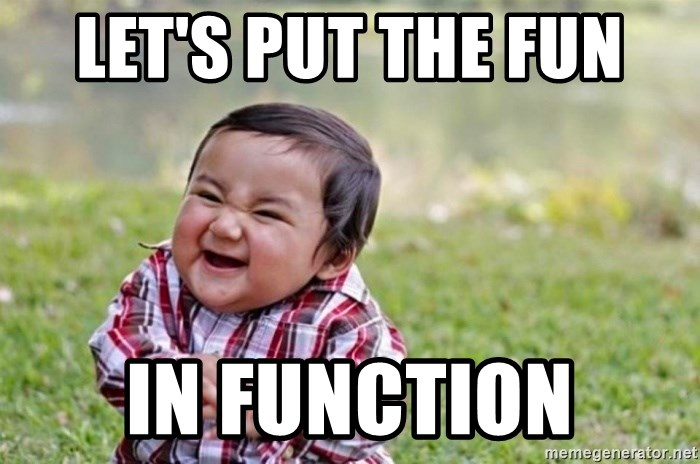

<h1 align="center">Grundlagen der Programmierung</h1>
<h3 align="center">Funktionen</h3>
<br>

<p align="center">
  
</p>

#### Beschreibung:

Willkommen zu den Aufgaben von Tag 11!
Heute hast du etwas über Funktionen gelernt.
Funktionen können vielfältig genutzt werden.
In den kommenden Tagen wirst du noch mehr Nutzen von Funktionen erfahren.
Heute geht es jedoch darum, dass du einmal mit Funktionen hantierst, 
um ein Gespür dafür zu bekommen, wie Funktionen funktionieren.
In den folgenden Übungen kannst du dein neues Wissen praktisch anwenden.


#### Hinweise zur Bearbeitung:

- Achte auf einen sauberen Quellcode, insbesondere Einrückungen sind wichtig!

---

<details>
<summary> <b> Aufgabe 1 - Funktion implementieren und aufrufen </b> </summary>

Willkommen zu deiner ersten Aufgabe in dieser Übung. In dieser Aufgabe wirst du deine erste Funktion implementieren. Die beschriebene Funktion wird in der Konsole eine Summe ausgeben.

Vorgaben:
- fange oberhalb der main-Funktion an
- schreibe das Keyword für Funktionen “fun”
- nenne deine Funktion “sum()”
- lege im Rumpf zwei Variablen an:
  - number1 = 3
  - number2 = 7
- gebe mit der print-Anweisung die Summe in der Konsole aus “print(number1 + number2)”
- rufe “sum()” in der Main-Funktion auf


**Datei für die Aufgabe:** *1_FunktionImplementierenUndAufrufen*

</details>

---

<details>
<summary> <b> Aufgabe 2 - Name für Funktion entwerfen  </b> </summary>

It’s magic time. Worte und Namen sind mächtig. Was denkst du wieso alle Zauberer und Magier ihre Magie mit Sprüchen wirken. Diese Macht gilt für alles was einen Namen hat. Deswegen sei weise in der Namensgebung. Ansonsten wird dir dessen Magie noch zum Verhängnis. Bist du ein Champion der magischen IT-Künste? Das wirst du in den folgenden Aufgaben herausfinden.
Weiter unten findest du einen Codeschnipsel einer Funktion. Mit dieser Funktion kann ein Zauberer einen Schutzzauber wirken. Überlege dir einen passenden Namen.

```
fun _________(){
   var magicNo1 = "Expecto"
   var magicNo2 = "Patronom"
   print(magicNo1 + magicNo2 + "!!!")
}
```

**Datei für die Aufgabe:** *2_Textabgabe.kt*

</details>

---

<details>
<summary> <b> Aufgabe 3 - Name für Funktion entwerfen  </b> </summary>

Dein Chef hat eine Formel entdeckt, mit der er das Volumen eines Würfels berechnen kann. Aber er tut sich schwer mit der Namensgebung. Kannst du Ihm dabei helfen einen geeigneten Namen zu formulieren?

```
fun _______(){
   var side = 4
   var volume = side * side * side
   print("Das Volumen des Wuerfels betraegt: " + volume + " cm^3")
}

```

**Datei für die Aufgabe:** *3_Textabgabe.kt*

</details>

---

<details>
<summary> <b> Aufgabe 4 - Vorhersagen, wo Programmfluss bei Funktionsaufruf als Nächstes hinspringen würde </b> </summary>

Hier gibt es jetzt 2 Funktionen, die in der Main-Funktion aufgerufen werden. Schreibe in die Aufgabe was in der Konsole ausgegeben wird.

Beantworte danach die Fragen in der Datei.

```
fun animal() {
    val myAnimal: String = "Dog"
    println(myAnimal)
}
fun number() {
    val myNumber: Int = 8
    println(myNumber)
}
fun main(){
   number()
   animal()
}
```

**Datei für die Aufgabe:** *4_Textabgabe.kt*

</details>

---

<details>
<summary> <b> Aufgabe 5 - Vorhersagen, was Funktion ausgeben würde  </b> </summary>

Wie macht der Hund? Im Folgendem Beispiel haben wir eine Funktion gegeben, die bellen() heißt. Aber es sind Laute von verschiedenen Tieren gegeben. Welche der Variable sollte ausgegeben werden, damit das bellen() richtig ist?

```
fun bellen(){
var b1 = "Wuff"
var b2 = "Miau"
var b3 = "AUUUUUU"
var b4 = "Kleff"
}
```

**Datei für die Aufgabe:** *5_Textabgabe.kt*

</details>

---

<details>
<summary> <b> Aufgabe 6 - Hier stimmt doch was nicht?  </b> </summary>

Diese Funktion sollte eigentlich zwei Zahlen addieren, allerdings hat der Programmierer hier einen Fehler gemacht. Schreibe in deinen eigenen Worten auf wo der Fehler liegt. 

```
addition() {
    val number1 = 10
    val number2 = 4
    println(number1 + number2)
}
```

**Datei für die Aufgabe:** *6_Textabgabe.kt*

</details>

---

<details>
<summary> <b> Aufgabe 7 - Vorhersagen, was Funktion ausgeben würde  </b> </summary>

Was genau wird in der gegebenen Funktion ausgegeben?

```
fun myFavoriteMovie() {
    val movies: MutableList<String> = mutableListOf("Matrix", "Avengers", "Der Pate", "Toy Story")
    val favMovie: String = movies[movies.size-1]
    println(favMovie)
}
```

**Datei für die Aufgabe:** *7_Textabgabe.kt*

</details>

---

<details>
<summary> <b> Aufgabe 8 - Funktion entwerfen  </b> </summary>

a)
Ein Freund hat eine Entdeckung gemacht. Er hat rausgefunden, wie man den Flächeninhalt eines Quadrats berechnet. Die Formel ist a*a. Mit dieser Formel kann man auch den Inhalt eines rechtwinkligen Dreiecks berechnen, indem man das ganze durch 2 teilt.

Implementiere die Berechnung für ein rechtwinkliges Dreieck in einer Funktion. Am Ende dieser Funktion soll das Ergebnis mit println() ausgegeben werden. Überlege dir auch einen passenden (englischen) Namen. Die Seiten des Quadrats sollen hier 4 cm Länge haben.

b)
Ändere nun die Funktion, die du in a) geschrieben hast. 
Die Seitenlänge des Quadrats soll nun nicht mehr statisch 4cm sein, sondern vom Nutzer mithilfe einer Eingabe zur Laufzeit bestimmt werden.

**Datei für die Aufgabe:** *8_FunktionEntwerfen.kt*

</details>

---

<details>
<summary> <b> Aufgabe 9 - Funktion entwerfen </b></summary>

Schreibe eine Funktion waitForSeconds.
- Innerhalb dieser Funktion soll der Nutzer eine Ganzzahl-Eingabe via der Konsole machen. Diese Eingabe soll dann genutzt werden, um das Programm so viele Sekunden anzuhalten.
- Tipp: Um das Programm warten zu lassen, benutze Thread.sleep(). 
- Thread erwartet von uns gesagt zu bekommen, wieviele Millisekunden das Programm schlafen soll.
- Die Millisekunden müssen als long angegeben werden. Wandle also den Input des Nutzers um mit toLong().
- Rufe diese Funktion in der main-Funktion auf!
</details>

---

<details>
<summary> <b> Aufgabe 10 - Funktion entwerfen </b></summary>

- Gegeben ist eine Liste mit 20 beliebten deutschen Vornamen und eine Map aus Nachnamen und deren Häufigkeit.
- a) Schreibe nun eine Funktion nameGenerator(). Diese Funktion nimmt einen zufälligen Vornamen und Nachnamen aus den Listen und gibt so dann einen Vollständigen Namen auf der Konsole aus:
- b)  Schreibe eine 2. Funktion fancyNameGenerator() . Diese Funktion soll uns einen Namen mit der Folgenden Form generieren:
  "$vorname1-$vorname2 von $nachname".
- c)starte das main-Programm, sodass jeweils 5 Namen und 5 fancy Namen ausgegeben werden.

</details>

